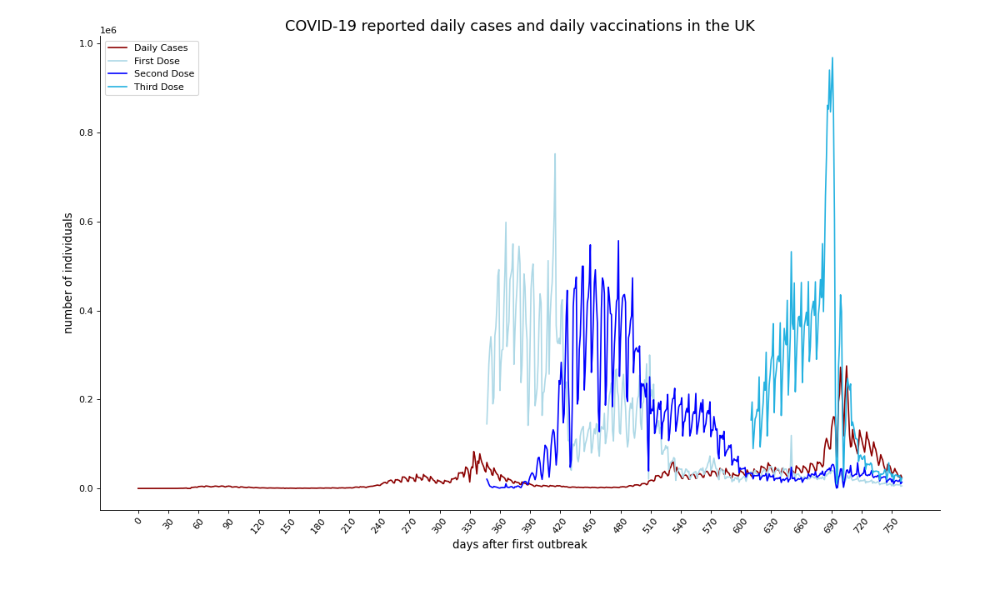
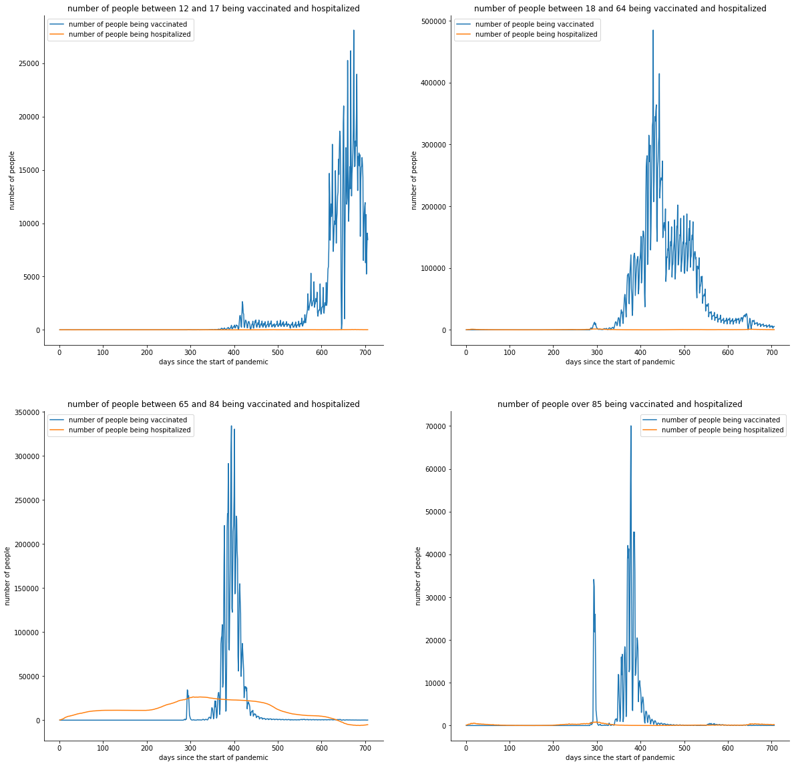
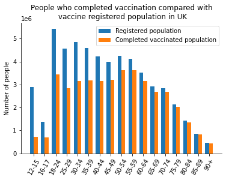
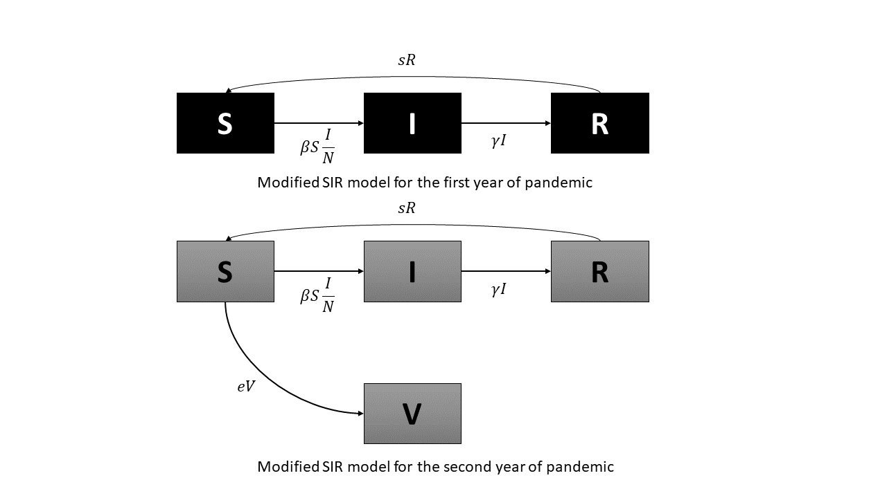
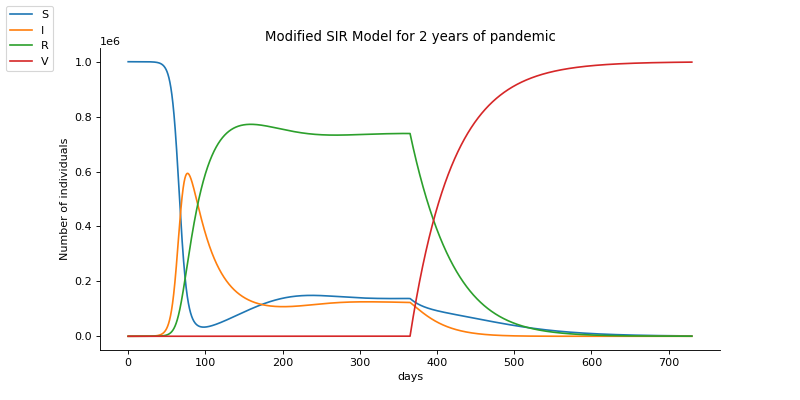

# Interdisciplinary Research Computing project: Validating efficacy and effectiveness of the current COVID-19 vaccines on different age groups 

## A bit about ourselves 
We are four second year students at Imperial College London: Nine Kinnman, Nichakorn Pipatpadungsin (Pao), Jialin Liu (Lester) and Christoforos Georgios Fistouris. Each studying different subject, we brought our skills together, which combined mathematics, medical sciences, and computer science, to create this project studying a global issue that has plagued us for the last two years. Our group advisor, Yiannis Simillides guided us through this project and helped us achieve it.

## Introduction to our interdisciplinary project 
Since the first outbreak of COVID-19 and the start of the pandemic in the late of 2019, governments and various pharmaceutical companies around the world have collaborated for the development of vaccines against COVID-19. The first vaccine to be approved was the CanSino vaccine in China which was used by the military[3]. Since then, various different types of vaccines have been developed from big pharmaceutical companies, such as Pfizer–BioNTech (mRNA vaccine), Johnson & Johnson (modified adenovirus vaccine), AstraZeneca (modified adenovirus vaccine) and Moderna (mRNA vaccine). COVID-19 vaccines have shown to be effective in the protection against the disease. For example, previous clinical trials have shown Pfizer’s vaccine to have up to 95%[1,4]. Nonetheless, these statistics have changed with age and the emergence of variants of concern [2]. Also, it is still difficult to predict the effectiveness of the same vaccine administered to another population [1]. We think investigating and building a model for the observed effectiveness of covid vaccines could be a good start. Therefore, in this project, we aim to produce a mathematical model to measure an impact of age as a factor in the vaccines’ effectiveness in protecting against COVID-19.

## Our research question
Can we get the same efficacy and effectiveness of the COVID-19 vaccines observed in the clinical trials using our mathematical analysis and does it vary depending on the age of the population receiving it?

## 1. What did we get by just looking at the real-world data?
Before venturing into any complicated data analysis, we think it would be a great starting point to first look at the data available. We managed to retrieve datasets from the NHS for number of cases and vaccinations in the UK (see datasets used) for our analysis. From what we see in the plot (see Figure 1 below) for number of cases and vaccinations against time, 3 peaks of infection can be clearly seen. Roughly starting at the end of the first year of the pandemic, first dose of vaccines are starting to be taken up. This seems to correlate well with the drop of infections. The second dose seems to have further dampened the infection rate during the middle of the second year. However, a small surge of infection rises again in the middle of the second year and it has well been sustained until the third surge of infection towards the end of the second year. Looking at this graph, we can see crude correlations between vaccination rate and infection rate. However, ther might be some caveats such as, for the second and third waves, vaccination rate reaches their peaks before infection rate. This could be because the time needed for the vaccination to develop full immunity within an individual. To see the effect of vaccinations on each age group we then plot another graph for each age group.

###### **Figure 1** Daily reported cases of COVID-19 and daily vaccinations in the UK

## 2. What mathematical models did we use?
Using data from the NHS website, we were able to build different mathematical models to interpret the data to answer our research question. 

### Vaccination and hospitalization for different age groups

From the NHS website, we downloaded cumulative number of vaccination and hospitalization data. However, as a lot of data was included which made them quite messy, they needed to be tidied up. To start our analysis, we used the loadtxt function to load all the csv files in python. Then, we noticed that the vaccination data was divided into more age groups than the hospitalization data, so in order to compare these data properly, we combined some of the age groups for the vaccination data. The next problem we encounterded was to work out the daily increase, as these data are all cumulative numbers. So, we used several 'for' loops to take the difference of numbers for each two days. After tidying up our data, we used plt.subplot function to make a plot containing results of four age groups as shown below.

###### **Figure 2** Vaccination compared with hospitalization for different age groups

From the graph, we can see that the hospitalization number of young people (people below 65 years old) is constantly low. We can only conclude that the virus does not take a serious form in young people. But if we look at the trend of curves for the last two plots, the hospitalization number reduced significantly after the peak of vaccination, so we can safely conclude that the vaccine is reducing the number of hospitalization. In another word, the vaccine is very effective and is protecting older people from developing serious cases of the disease. 

### Proportion of people taking the vaccine in the UK

From our downloaded data, we also made a bar chart showing the proportion of people that took the vaccine. \

###### **Figure 3** People who completed vaccination compared with vaccine registered population in the UK plot

As we can see, the proportion of old people taking the vaccine is relatively higher, and this is consistent with our result from the previous part: old people are at higher risk of serious illness form COVID-19 and the vaccine is effectively protecting old people.

### Mathematical analysis for vaccines in the SIR model including vaccination

### How was the model created? ###
The model was built based on the idea of the SIR model used in mathematical biology, where each letter means a different category. "S" stands for Susceptible people, "I" stands for Infected people and finally "R" stands for Recover people. Mathematically, this is solved using ordinary differential equations but first let's try to build this model from scratch. Consider the below diagram:

###### **Figure 4** Modified SIR Model build to include the number of vaccinated individuals

Each individual can be only in one compartment at a given time, but can definitely move from one to another. The SIR model is one of the most basic compartmental models, if not the most basic, with 3 compartments (Susceptible, Infected, and Recovered). The assumed progression is for a susceptible individual to become infected through a contact with another individual who is already infected. There is a period as an infected individual, during which that person is said to be contagious, and afterwards the individual advances to a state termed recovery. Not all susceptibles can be infected at once, but there is a rate at which susceptible individuals become infected and this is dependent on the number of individuals in each of the susceptible and infected states. When an outbreak starts, there are few infected individuals, which means that the disease spreads in a very slow rhythm. As more people become infected, they contribute to the faster spread and increase the rate of infection, since more people get infected. We cannot forget an additional factor in calculating the rate of spread, which is the effective contact rate (β). This parameter accounts for the transmissibility of the disease. There are many community mitigation strategies, such as quarantining infected individuals, closing schools, social distancing, which can reduce this value and slow the spread. Although these interventions can alter the movement of individuals from the susceptible state to the infected state, the transition from the infected to the recovered compartment is solely dependent on the amount of time that an individual is contagious, captured in the rate of recovery(γ).
This model contains only 2 parameters: the effective contact rate (β), which affects the transition from the susceptible compartment to the infected compartment, and the rate of recovery (also known as mortality; γ), which affects the transition from the infected state to the recovered state.
Now, in case that the rate at which individuals become infected is bigger than the rate at which infected individuals recover, an accumulation of individuals in the infected compartment will occur. The basic reproduction number R0 is the mean number of new infections caused by a single infected individual over the course of their illness and is given by the ratio of β and γ. A slight decrease in the effective contact rate β through community mitigation strategies will slight decrease the reproduction number, delaying and lowering the peak infection rate that occurs in the epidemic (i.e., “flattening the curve”). However, to maintain the decrease in total infections, the decrease in R0 generally must be sustained for a long period.
Our new model, with vaccination, was based on the SIR model, but we added the compartment of "Vaccinated people". Since more people are vaccinated, the infected people would get reduced since they have immunity by the vaccine. The differential equation characterized the Vaccinated state is that the rate of change of vaccinated people equals with the starting of vaccinated people plus a constant of vaccine efficiency times the number of Susceptible people times the time interval that vaccination occurs. In addition, we account for another constant which reflects the "Average loss of immunity" since as proven, the vaccines "lose" their strength after a certain period of time, and this was included in the model produced.
With all these features, we made a statistical analysis and created graphs for the COVID-19 pandemic before and after vaccination.

###### **Figure 5** Modified SIR model including the number of vaccinated individuals for COVID-19 for 2 years of pandemic. parameters used were: β = 0.01, γ = 1/720, s = 1/4320, V = 0.001, e = 0.75.

## Conclusion and discussion
From our different mathematical analysis, we concluded that: 
- The virus seems to not take a serious form in young people, based on the number of hospitalised people and the proportion of older people (>50 years old) taking the vaccine is relatively higher than younger people.
- Vaccination against COVID-19 is very effective in protecting older people from developing serious cases of the disease and being hospitalised for it.
- The modified SIR model with vaccination included shows that with increasing rate of vaccination, the number of susceptible, infected and recovered individuals decreases. 

Our research question focused on testing if our statistical analysis were in line with results found in clinical trials, regarding the efficiency of the vaccines in protecting people against COVID-19, as well as comparing it based on the age group of the individuals. Based on our analysis of the data, we found that vaccination does in fact reduce the number of serious cases of covid in poeple of an older age group (65-84 years old). Moreover, the population of >50 years old is getting the most vaccinated. We also concluded based on our modified SIR model that an increase of the rate of vaccination is corrolated with a decrease in the number of suceptible, infected and recovered individuals. We also see the slow increase of infection during the first year. However, our model did not predict the second and third waves as happened in real world data. This further emphasises how new variants, not just waning immunity, drive the new waves of infection. Unfortunately, we have not succeeded in statistically analysing how reliable our model is. This could be an extension for future project.

## References
1.	Olliaro, P., Torreele, E. and Vaillant, M. (2021) COVID-19 vaccine efficacy and effectiveness—the elephant (not) in the room. The Lancet Microbe, 2(7), pp. e279–e280. doi: 10.1016/s2666-5247(21)00069-0.
2.	Collier, D. A. et al. (2021) Age-related immune response heterogeneity to SARS-CoV-2 vaccine BNT162b2. Nature, 596(7872), pp. 417–422. doi: 10.1038/s41586-021-03739-1.
3.	Banerjee, A. (2020) CanSino coronavirus vaccine shows immune response in human trial. Available at: https://www.reuters.com/article/us-health-coronavirus-cansinobio-idUSKCN24L1NP (Accessed 28 Feb 2022).
4.	Boseley, S., Oltermann, P., Hopes rise for end of pandemic as Pfizer says vaccine has 90% efficacy. Available at: https://www.theguardian.com/world/2020/nov/09/covid-19-vaccine-candidate-effective-pfizer-biontech (Accessed 28 Feb 2022).

5.https://jamanetwork.com/journals/jama/fullarticle/2766672

6.http://hplgit.github.io/prog4comp/doc/pub/._p4c-solarized-Python021.html
