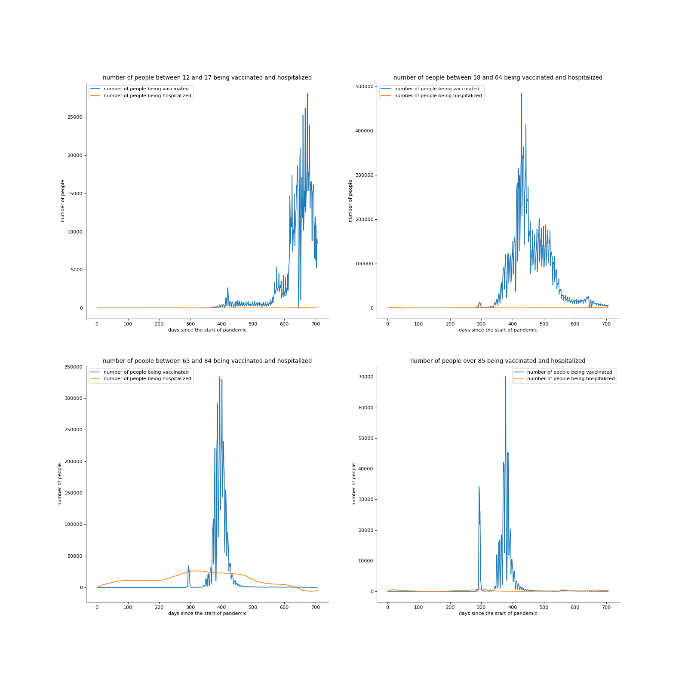

# Interdisciplinary Research Computing project: Validating efficacy and effectiveness of the current COVID-19 vaccines on different age groups 

# A bit about ourselves 
We are four second year students at Imperial College London: Nine Kinnman, Nichakorn Pipatpadungsin (Pao), Jialin Liu (Lester) and Christoforos Georgios Fistouris. Each studying different subject, we brought our skills together to create this project, which combined mathematics, medical sciences, and computer science, for a global issue that has plagued us for the last two years. 

## Introduction to our interdisciplinary project 
Since the first outbreak of COVID-19 and the start of the pandemic in 2020, governments and various pharmaceutical companies around the world have collaborated for the development of vaccines against COVID-19. The first vaccine to be approved was the CanSino vaccine in China which was used by the military [3]. Since then, many different types of vaccines have been developed from big pharmaceutical companies, such as Pfizer–BioNTech (mRNA vaccine), Johnson & Johnson (modified adenovirus vaccine), AstraZeneca (modified adenovirus vaccine) and Moderna (mRNA vaccine). COVID-19 vaccines have shown to be effective in the protection against the disease. For example, previous clinical trials have shown Pfizer’s vaccine to have up to 95%[1,4]. Nonetheless, these statistics have changed with age and the emergence of variants of concern [2]. Also, it is still difficult to predict the effectiveness of the same vaccine administered to another population [1]. We think investigating and building a model for the observed effectiveness could be a good start. Therefore, in this project, we aim to produce a statistical model to measure an impact of age as a factor in the vaccines’ effectiveness in protecting against COVID-19.

# Our research question
Can we get the same efficacy and effectiveness of the COVID-19 vaccines observed in the clinical trials using our statistical analysis and does it vary depending on the age of the population receiving it?

# What did we get by just looking at the real-world data?
Before venturing into any complicated data analysis, we think it would be a great starting point to first look at the data available. We managed to retrieve datasets from the NHS for number of cases and vaccinations in the UK (see datasets used) for our analysis. From what we see in the plot (see Figure 1 below) for number of cases and vaccinations against time, 3 peaks of infection can be clearly seen. Roughly starting at the end of the first year of the pandemic, first dose of vaccines are starting to be taken up. This seems to correlate well with the drop of infections. The second dose seems to have further dampened the infection rate during the middle of the second year. However, a small surge of infection rises again in the middle of the second year and it has well been sustained until the third surge of infection towards the end of the second year. Looking at this graph, we can see crude correlations between vaccination rate and infection rate. However, ther might be some caveats such as, for the second and third waves, vaccination rate reaches their peaks before infection rate. This could be because the time needed for the vaccination to develop full immunity within an individual. To see the effect of vaccinations on each age group we then plot another graph for each age group.

###### **Figure 1** initial plot for data analysis

# Vaccination and hospitalization for different age group
From the NHS website, we downloaded cumulative number of vaccination and hospitalization data. However, as a lot of data was included which made them quite messy, they needed to be tidied up. To start our analysis, we used the loadtxt function to load all the csv files in python. Then, we noticed that the vaccination data was divided into more age groups than the hospitalization data, so in order to compare these data properly, we combined some of the age groups for the vaccination data. The next problem we encounterded was to work out the daily increase, as these data are all cumulative numbers. So, we used several 'for' loops to take the difference of numbers for each two days. After tidying up our data, we used plt.subplot function to make a plot containing results of four age groups as shown below.

###### **Figure 2** vaccination compared with hospitalization for different age groups
From the graph, we can see that the hospitalization number of young people (people below 65 years old) is constantly low. We can only conclude that the virus is not serious for young people. But if we look at the trend of curves for the last two plots, the hospitalization number reduced significantly after the peak of vaccination , so we can safely conclude that the vaccine is reducing the number of hospitalization. In another word, the vaccine is very effective and is protecting old people. 

# Proportion of people taking the vaccine
From our downloaded data, we can also make a bar chart showing the proportion of people taking the vaccine. As we can see, the proportion of old people taking the vaccine is relatively higher, and this is consistent with our result from the previous part: the virus is more serious to old people and the vaccine is protecting old people effectively. 

###### **Figure 3** people completed vaccination compared with vaccine registered population plot
